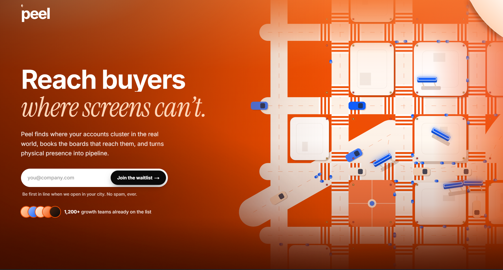
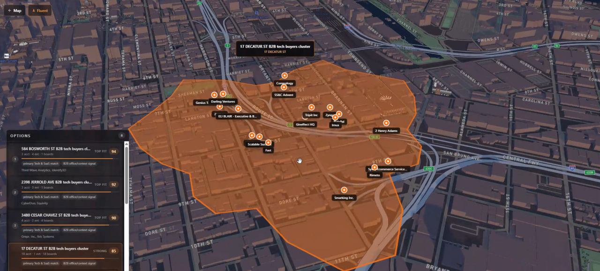
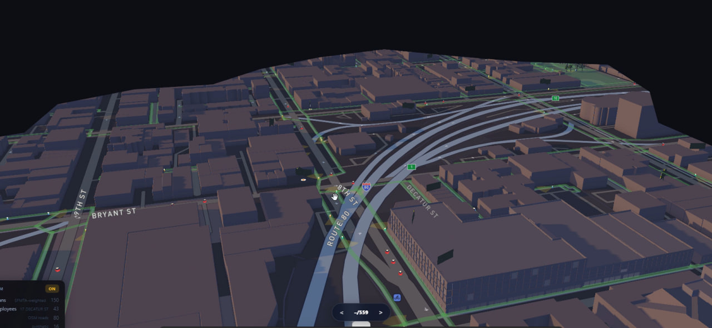
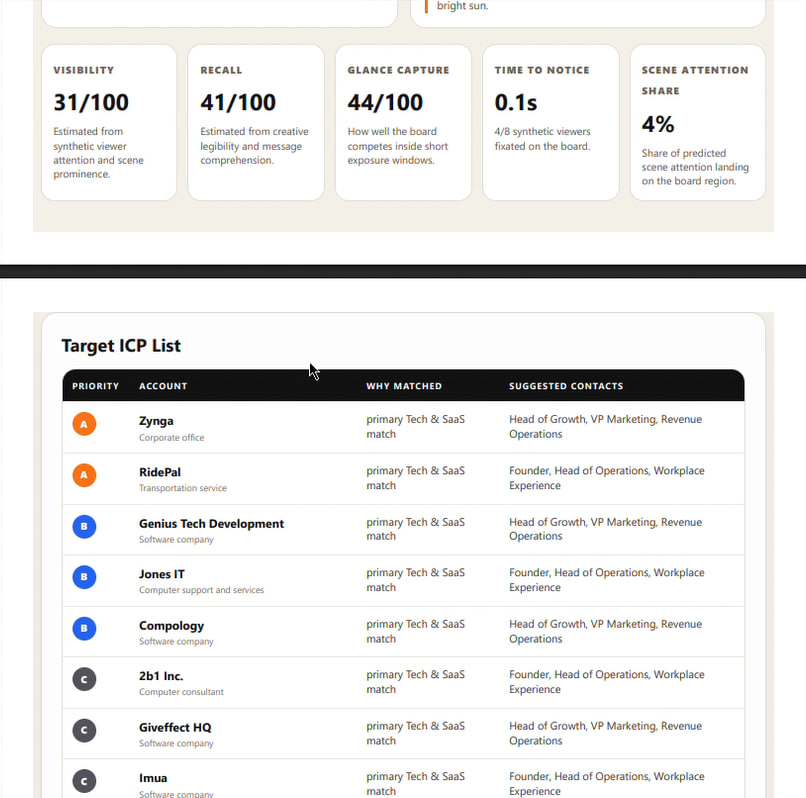
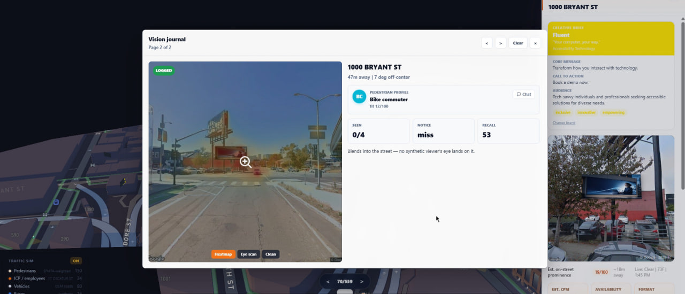
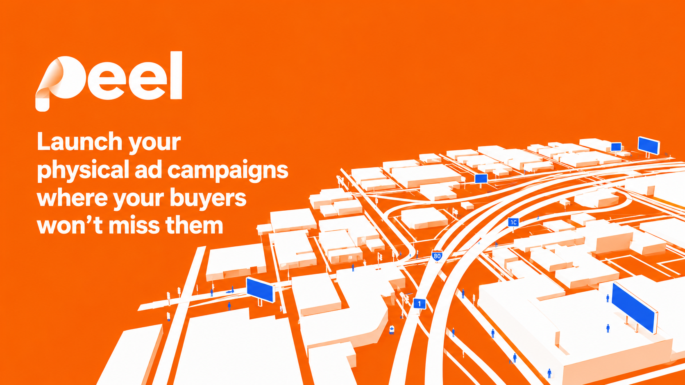

<div align="center">

# Peel — Reach buyers where screens can't

**A physical GTM engine that finds where your accounts cluster in the real world, books the out-of-home boards that reach them, and turns physical presence into pipeline.**



[](https://nextjs.org/)
[](https://react.dev/)
[](https://www.typescriptlang.org/)
[](https://www.mapbox.com/)
[](https://deck.gl/)
[](https://threejs.org/)
[](https://convex.dev/)
[](LICENSE)

</div>

---

## Overview

Digital advertising is saturated, ad-blocked, and increasingly expensive per qualified impression. Meanwhile, the physical world — the billboards commuters pass, the corridors buyers walk — is still sold like real estate: static inventory, generic media kits, and manual outreach.

**Peel closes that gap.** It treats out-of-home (OOH) advertising as a targeted, account-based growth channel. Given a company's website and ideal customer profile (ICP), Peel:

1. **Discovers** where target accounts physically cluster across a city.
2. **Scores** the real out-of-home inventory that reaches those clusters using geometry-grounded visibility signals.
3. **Simulates** how a board is actually seen — line of sight, occlusion, dwell time, and creative saliency — in an interactive 3D scene.
4. **Generates** board-specific creative and a personalized outbound pitch for each best-fit advertiser.
5. **Exports** a campaign package (PDF) and stages outbound, ready to push into CRM and sequencing tools.

The 3D map and visibility simulation aren't the product on their own — they are the **proof layer** inside a defensible sales motion.

> Peel identifies commercial context around a billboard, scores the board's physical visibility, and turns that signal into targeted advertiser outreach.



<div align="center"><sub>Peel maps where target accounts physically cluster — here a B2B tech-buyer hotspot in SoMa — and ranks each cluster by fit and board reach.</sub></div>

---

## Highlights

- **Geospatial intelligence** — 559 real, permitted San Francisco billboards (scraped from the city's General Advertising Sign Program) rendered on a 3D Mapbox globe with `deck.gl` and `react-three-fiber` layers.
- **Physics-grounded visibility scoring** — practical, defensible metrics (line of sight, building occlusion, apparent size, dwell time) computed from map geometry rather than invented conversion claims.
- **Agent-based crowd & traffic simulation** — pedestrian and vehicle flows model who actually passes each board and how long they dwell.
- **In-browser vision models** — billboard detection and creative saliency run client-side via `@huggingface/transformers` (WebGPU/WASM).
- **LLM creative + outbound generation** — board-specific ad mockups and personalized pitches, with a graceful SVG fallback when no model key is configured.
- **One-click campaign export** — a full PDF campaign package (opportunity, board buying facts, ranked target accounts, and proof) generated on the server with Playwright.

---

## Product Loop

| Stage | What Peel does |
| --- | --- |
| **1. Accounts** | Infers the creative brief and ICP from a company's site, then discovers physical-world "opportunity blobs" where matching accounts concentrate. |
| **2. Boards** | Ranks permitted billboard inventory inside each blob by ICP density × physical visibility × dwell × creative suitability. |
| **3. Creative** | Generates a board-specific creative concept and mockup composited into the local scene. |
| **4. Outbound** | Drafts a personalized pitch per best-fit advertiser and stages rows for CRM / sequencing hand-off. |

Every claim is scoped by what is **computed** (coordinates, nearby businesses, visibility geometry, enrichment) versus **modeled** (audience context, advertiser fit) versus a **future measurement layer** (brand-search lift, geofenced conversion). That boundary is what keeps the pitch credible.

### Inside the app



<div align="center"><sub>A full-screen 3D scene of the city with live pedestrian, ICP-employee, and vehicle simulation across 559 permitted SF boards.</sub></div>

<br />



<div align="center"><sub>Physics-grounded visibility scoring — visibility, recall, glance capture, time-to-notice, and scene-attention share — alongside a ranked, contact-mapped Target ICP list.</sub></div>

<br />



<div align="center"><sub>Vision Studio replays how a specific pedestrian profile actually sees a board from the street, with SEEN / NOTICE / RECALL read-outs beside the creative brief driving the mockup.</sub></div>

---

## Architecture

```
┌──────────────────────────────────────────────────────────────┐
│  Next.js 15 App Router (React 19, TypeScript, Tailwind v4)     │
│                                                                │
│  /            Campaign workspace — blobs, ranked boards,       │
│               creative + outbound flow                         │
│  /map         Full-screen 3D Mapbox + deck.gl scene            │
│  /vision      Vision Studio — in-browser detection & saliency  │
│  /sightline   Line-of-sight / visibility inspector             │
│                                                                │
│  /api/*       Opportunities · creative · outbound · streetview │
│               vision-simulate · campaign-report (PDF) · …      │
└───────────────┬───────────────────────────┬──────────────────┘
                │                            │
        ┌───────▼────────┐          ┌────────▼─────────┐
        │  Convex         │          │  orangeslice /    │
        │  (realtime      │          │  Fiber AI         │
        │   backend)      │          │  (enrichment,     │
        └────────────────┘          │   outbound data)  │
                                     └──────────────────┘
```

### Tech stack

| Layer | Technology |
| --- | --- |
| **Framework** | Next.js 15 (App Router), React 19, TypeScript 5.7 |
| **3D / Geospatial** | Mapbox GL, deck.gl, react-map-gl, Three.js, react-three-fiber, drei |
| **ML in the browser** | `@huggingface/transformers` (billboard detection, saliency) |
| **Backend / realtime** | Convex |
| **Enrichment & outbound** | orangeslice / Fiber AI |
| **Server rendering** | Playwright (PDF campaign export, street-view compositing) |
| **Validation** | Zod |
| **Styling** | Tailwind CSS v4, PostCSS |

---

## Getting Started

```bash
# 1. Configure environment
cp .env.local.example .env.local   # add Mapbox + optional model/enrichment keys

# 2. Install dependencies
npm install

# 3. Run the dev server
npm run dev
```

Open **http://localhost:3000**.

The app runs without paid keys: opportunity scoring, the 3D scene, and creative generation all fall back to bundled data and SVG mockups. Add keys in `.env.local` to enable live enrichment, LLM creative, and street-view compositing.

### Useful scripts

| Command | Purpose |
| --- | --- |
| `npm run dev` | Start the local dev server |
| `npm run build` | Prefetch map data and build for production |
| `npm run convex:dev` | Run the Convex backend locally |
| `node scripts/scrape-billboards.mjs` | Re-pull the live SF billboard inventory |

---

## Billboard Data

Real San Francisco billboard inventory ships in [`data/`](data/), scraped from SF Planning's **General Advertising Sign Program (GASP)** — the city's registry of permitted billboards. The current dataset contains **559 signs with exact WGS84 coordinates**.

| File | Use |
| --- | --- |
| `data/sf-billboards.geojson` | Mapbox-ready `FeatureCollection` of points |
| `data/sf-billboards.csv` | Spreadsheet / analysis format |

Each sign carries its street address, permit status and lifecycle dates, city permit number with Accela links, and assigned planner contact. GASP is *physical inventory*, not a rental marketplace — bookable metadata (dimensions, impressions, CPM, pricing) would come from commercial OOH platforms or seller-provided data, and the app is explicit about which fields are estimated.

Refresh the data at any time (no API key required):

```bash
node scripts/scrape-billboards.mjs
```

---

## Repository Layout

```
app/
  components/      3D map, billboard meshes, crowd & traffic layers, flows
  lib/             visibility, saliency, attention, creative, campaign report
  api/             opportunities, creative, outbound, vision, PDF export
  map/ vision/ sightline/   feature routes
convex/            realtime backend functions
data/              scraped SF billboard inventory + enrichment caches
scripts/           data prefetch, scraping, build tooling
public/            static map data and creative assets
docs/              design notes and screenshots
```

---

## Roadmap

- **Measurement layer** — brand-search lift, QR / short-code response, geofenced conversion, and holdout-market experiments to move from modeled fit to attributed ROAS.
- **National inventory** — extend beyond SF GASP to commercial OOH marketplaces.
- **CRM push** — direct sync of staged outbound into HubSpot, Salesforce, and Attio.

---

## License

Released under the [MIT License](LICENSE).

---



<div align="center">

Built for the physical GTM era — where the best channel is the one your competitors forgot.

</div>
